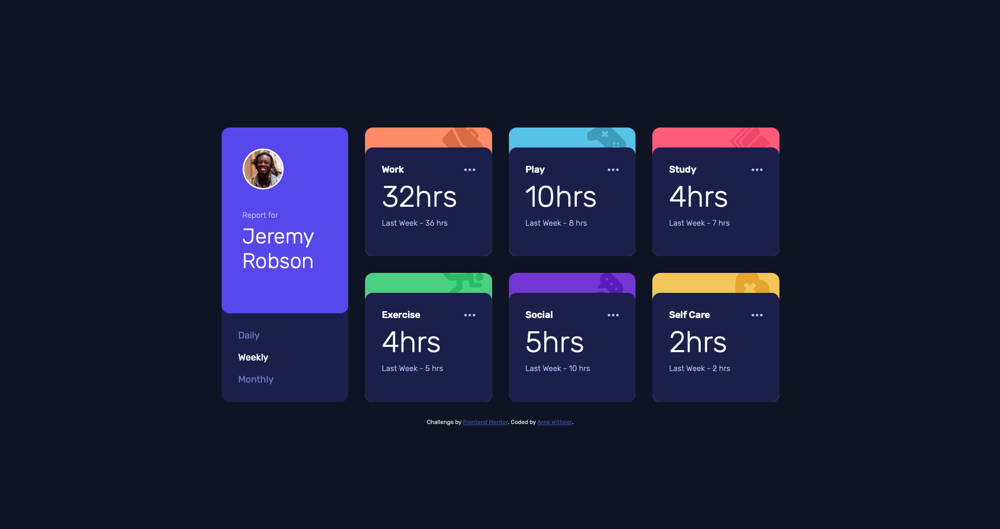

# Frontend Mentor - Time tracking dashboard solution

This is a solution to the [Time tracking dashboard challenge on Frontend Mentor](https://www.frontendmentor.io/challenges/time-tracking-dashboard-UIQ7167Jw). Frontend Mentor challenges help you improve your coding skills by building realistic projects. 

## Table of contents

- [Frontend Mentor - Time tracking dashboard solution](#frontend-mentor---time-tracking-dashboard-solution)
  - [Table of contents](#table-of-contents)
  - [Overview](#overview)
    - [The challenge](#the-challenge)
    - [Screenshot](#screenshot)
    - [Links](#links)
  - [My process](#my-process)
    - [Built with](#built-with)
    - [What I learned](#what-i-learned)
  - [Author](#author)

## Overview

### The challenge

Users should be able to:

- View the optimal layout for the site depending on their device's screen size
- See hover states for all interactive elements on the page
- Switch between viewing Daily, Weekly, and Monthly stats

### Screenshot



### Links

- Solution URL: [Frontend Mentor solution](https://github.com/arne-witteler/time-tracking-dashboard)
- Live Site URL: [Live demo](https://time-tracking-dashboard-tau-one.vercel.app)

## My process

### Built with

- Semantic HTML5 markup
- CSS custom properties
- Flexbox
- CSS Grid
- Mobile-first workflow
- Vanilla JavaScript

### What I learned

This project was a great practice for fetching local JSON data and dynamically updating the DOM. One major challenge was connecting the data from the JSON file with the correct HTML elements.

I learned how to convert the titles from the JSON (e.g., "Self Care") into valid CSS class names (e.g., "self-care") using string manipulation. This allowed me to loop through the data and target the specific cards without hardcoding IDs.

```js
// This logic helped me match the JSON data to my HTML classes
const className = item.title.toLowerCase().replace(' ', '-');
const card = document.querySelector(`.${className}`);

I also improved my understanding of CSS Grid for the desktop layout, specifically how to make the profile card span two rows while the other cards align perfectly next to it.


@media (min-width: 768px) {
  .container {
    display: grid;
    grid-template-columns: repeat(3, 1fr);
    grid-template-rows: repeat(2, auto);
  }
  
  .profile {
    grid-row: span 2;
  }
}
```

## Author

- Frontend Mentor - [@arne-witteler](https://www.frontendmentor.io/profile/arne-witteler)

